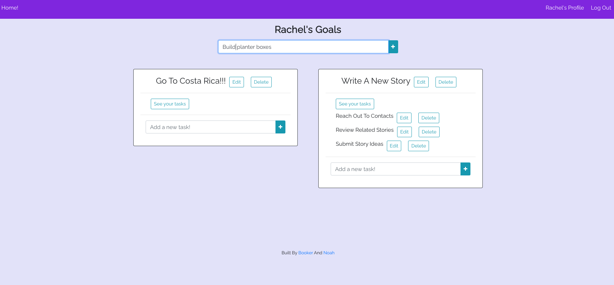

# Goal Getter

### A basic goal setting app that allows you to break your goals down into simple tasks to complete.

## Features

#### * Allows you to associate tasks to goal
#### * Allows you to create goals tied to a user account
#### * User account is password protected so your goals stay safe

---
## Motivation
#### We love staying organized, so creating a simple tool to help facilitate that seemed like a perfect project.

---
## User Stories 

#### Users create an account and logs on, then creates goals and tasks (steps to achieve goals). Both goals and tasks can be edited or deleted.


####  Wireframes:

####   


####  ERD:

####  


## Planning Documentation
#### Can be found [here.](https://trello.com/b/r3hzoG3E/team-meta)


####  Screenshots:

####   


---

## Technologies & Code Snippets
#### * HTML, CSS, JavaScript, Node.JS, Sequelize, PostgresQL, React
#### * Sample code:
#### 
```
const UpdateGoal = ({goal, fetchData}) => {
   const [goalTitle, setGoalTitle] = useState(goal.title)

      const handleSubmit = (event) => {
        
      GoalModel.update({
         ...goal, 
         title: goalTitle
      })
      fetchData()
   }

```


#### 
```
import React, { createContext, useState } from 'react';
import UserModel from '../models/user';
export const AuthContext = createContext();

const AuthContextProvider = (props) => {
    const [currentUser, setCurrentUser] = useState(localStorage.getItem('id'));
    const [currentUserName, setCurrentUserName] = useState(localStorage.getItem('name'));
    const storeUser = (userId, userName) => {
        localStorage.setItem('id', userId);
        localStorage.setItem('name', userName);
        setCurrentUser( userId );
        setCurrentUserName( userName );
    };
    const logout = (event) => {
        localStorage.removeItem('id');
        localStorage.removeItem('name');
        UserModel.logout()
            .then(res => {
            setCurrentUser(null);
            setCurrentUserName(null);
            })
    }
    return (
        <AuthContext.Provider value={{currentUser, currentUserName, storeUser, logout}}>
            {props.children}
        </AuthContext.Provider>
    )
}
export default AuthContextProvider;
```
---
## Backend repo
#### Can be found [here.](https://github.com/enbre/goals-backend)

---
## Credits
#### Our teammates, our General Assembly instructors, TAs, and class mates were very helpful, as well as numerous video tutorials to better understand React. 

---

## Future development
#### Additions to come will be minor debugging, the ability to drag goals to reorder, and adding user color theme options.


